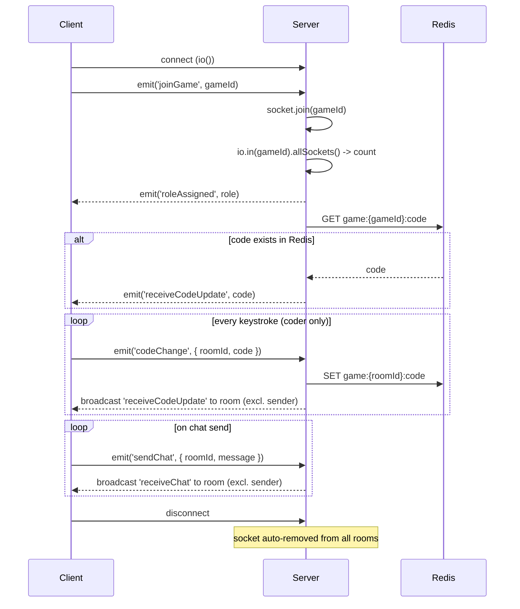

# WebSocket Event Protocol

Socket.IO, same origin as Next.js. Client connects with `io()` (no args). Server defined in `server.js`. Redis-backed for cluster-aware rooms and code state persistence.

---

## Shared Types

```typescript
type Role = 'coder' | 'tester' | 'spectator';

interface Message {
  id: string;    // random short string, e.g. Math.random().toString(36).substring(7)
  text: string;  // message body
  user: string;  // sender's role label: "Coder" or "Quality"
}
```

---

## Client → Server Events

### `joinGame`

Join a game room. Must be emitted immediately after connecting.

```typescript
socket.emit('joinGame', gameId: string);
```

| Field | Type | Description |
|---|---|---|
| `gameId` | `string` | The room identifier. Taken from the URL path `/playGame/[gameID]`. |

**Server behavior:**
1. Adds the socket to the Socket.IO room `gameId`.
2. Counts sockets in the room. Assigns role: 1st = `coder`, 2nd = `tester`, 3rd+ = `spectator`.
3. Emits [`roleAssigned`](#roleassigned) back to this socket only.
4. Reads `game:{gameId}:code` from Redis. If non-null, emits [`receiveCodeUpdate`](#receivecodeupdate) to this socket only.

---

### `codeChange`

Send updated code. Emitted by the coder on every keystroke (Monaco `onChange`).

```typescript
socket.emit('codeChange', {
  roomId: string,  // same as gameId
  code: string,    // full editor contents
});
```

| Field | Type | Description |
|---|---|---|
| `roomId` | `string` | Room to broadcast to. |
| `code` | `string` | Complete editor content (not a diff). |

**Server behavior:**
1. If `roomId` is falsy, the event is silently dropped.
2. Writes `code` to Redis at key `game:{roomId}:code` (no TTL).
3. Broadcasts [`receiveCodeUpdate`](#receivecodeupdate) to all other sockets in the room.

**Note:** This sends the full editor content on every keystroke. There is no debounce or diffing.

---

### `sendChat`

Send a chat message.

```typescript
socket.emit('sendChat', {
  roomId: string,
  message: Message,
});
```

| Field | Type | Description |
|---|---|---|
| `roomId` | `string` | Room to broadcast to. |
| `message` | `Message` | The chat message object (see [Shared Types](#shared-types)). |

**Server behavior:**
1. If `roomId` or `message` is falsy, the event is silently dropped.
2. Broadcasts [`receiveChat`](#receivechat) to all other sockets in the room.

Messages are **not persisted** server-side. Chat history only exists in each client's local React state.

---

## Server → Client Events

### `roleAssigned`

Tells the client what role they were assigned. Sent once, immediately after `joinGame`.

```typescript
socket.on('roleAssigned', (role: Role) => { ... });
```

| Field | Type | Values |
|---|---|---|
| `role` | `Role` | `'coder'`, `'tester'`, or `'spectator'` |

**Assignment logic:**

| Sockets in room (after join) | Role |
|---|---|
| 1 | `coder` |
| 2 | `tester` |
| 3+ | `spectator` |

---

### `receiveCodeUpdate`

Delivers code content. Sent in two situations:
1. **Broadcast** — when another socket in the room emits `codeChange` (excludes sender).
2. **Unicast** — when a socket joins a room that already has code stored in Redis.

```typescript
socket.on('receiveCodeUpdate', (code: string) => { ... });
```

| Field | Type | Description |
|---|---|---|
| `code` | `string` | Full editor content. Replaces whatever the receiver currently has. |

---

### `receiveChat`

Delivers a chat message from another player in the room. Excludes the sender.

```typescript
socket.on('receiveChat', (message: Message) => { ... });
```

| Field | Type | Description |
|---|---|---|
| `message` | `Message` | See [Shared Types](#shared-types). |

---

## Connection Lifecycle



No reconnection logic exists. If the socket disconnects, the client does not attempt to re-join.

---

## Server-Side State (Redis)

| Key pattern | Value | Written by | Read by | TTL |
|---|---|---|---|---|
| `game:{roomId}:code` | `string` (full editor content) | `codeChange` handler | `joinGame` handler | None |

No cleanup. Keys persist until Redis restart or eviction.
TODO: This should probably change.

---

## Error Handling

| Scenario | Behavior |
|---|---|
| Redis down during `joinGame` code fetch | `console.error`. Socket still joins the room and gets a role. No code sent. |
| Redis down during `codeChange` persist | `console.error`. Code is still broadcast to the room, just not persisted for late joiners. |
| `roomId` missing on `codeChange` | Silently dropped. |
| `roomId` or `message` missing on `sendChat` | Silently dropped. |
| Client disconnect | Logged. Socket.IO auto-removes the socket from all rooms. No app-level cleanup. |
