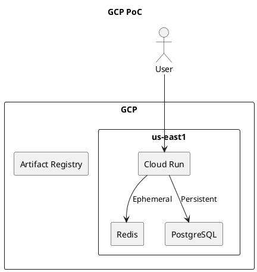

# System Block Diagram

```plantuml-diagram
@startuml
title GCP PoC

actor User

rectangle "GCP" {
  rectangle "us-east1" {
    rectangle "Cloud Run" as cr
    rectangle "Redis" as redis
    rectangle "PostgreSQL" as sql
  }
  rectangle "Artifact Registry" as ar
}

User --> cr

cr --> redis : Ephemeral
cr --> sql : Persistent
@enduml
```