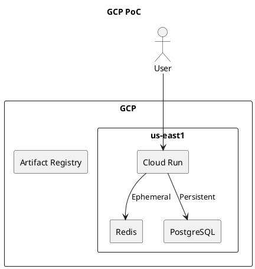

# System Block Diagram

## Description
This project stack will be deployed on Google Cloud Platform (GCP) and it follows a containerized architecture where users interact with the application through a frontend built with React. The front end communicates with our backend service on Cloud Run.

The backend application runs stateless containers on cloud run ensuring scalability. Redis is used for ephemeral data such as caching and short lived sessions, while PostgreSQL serves as the persistant data store.

Application container images are built and stored in Artifact Registry. Cloud Run uses the images  during deployment.

Overall this architecture isolates computation, storage and deployment concerns allowing scalability and reliability.