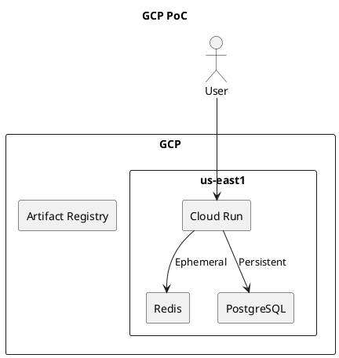

# System Block Diagram

## Description
This project stack will be deployed on Google Cloud Platform (GCP) and it utilized a containerized architecture where users interact with the application through a frontend built with NextJS and Bun. 
The application is containerized and deployed via Cloud Run for orchestrated scaling.

Redis (Google Memorystore) is used for ephemeral data such as match status, while PostgreSQL (CloudSQL) serves as the authoratative, persistent store for account info and similar.

Application container images are built automatically and stored in Artifact Registry via a GitHub Actions CI/CD pipeline.