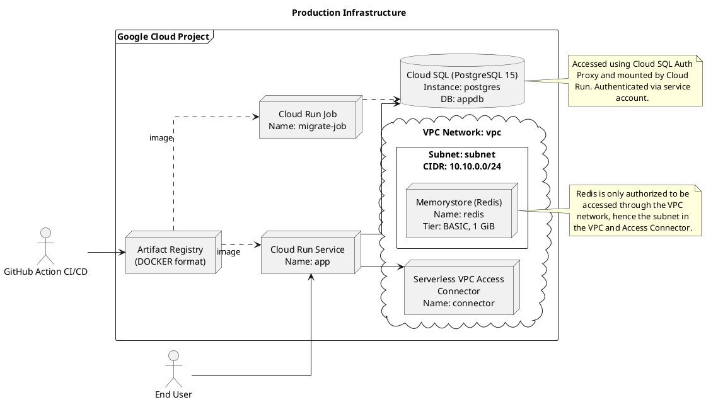

# Production Architecture

## Overview

The architecture is designed with a high level of inherent scalability, both vertically and horizontally. This is
achieved with an ephemeral, stateless application that can be autoscaled by orchestration systems. For local
development, the application can be run with a `.env` file and `docker-compose.yml`
file <!-- TODO: replace this with development environment link -->. This environment maps
perfectly to production, as discussed later.

The API will connect with two different data stores. For quick-access, ephemeral data, [Redis](https://redis.io/) will
be utilized. For an authoritative data store, [PostgreSQL](https://www.postgresql.org/) will be used. For more
information on the database design, see FILLER. <!-- TODO: replace this with database design doc page -->

## Diagram and Explanation

The above diagram demonstrates how the application is deployed via a GitHub action CI/CD pipeline. Two images are
created: the actual runner application (minimal, production environment from a multi-stage build) and the `migrate`
image, who's only job is to be run in a Cloud Run Job that deploys database schema updates when needed.

Note the high level of scalability: vertically, the tiniest, lowest-tier of machines are provisioned, allowing for
minimal development overhead and easy scaling if it should be needed. Additionally, the Cloud Run Service itself is horizontally
scalable from 0 -> N as needed. This architecture also allows for later multi-region scaling by moving the Cloud Run
Service into the VPC and creating clones of that VPC for individual regions. If needed, Cloud SQL can be scaled as well,
even put behind a [Kubernetes StatefulSet](https://kubernetes.io/docs/concepts/workloads/controllers/statefulset/) if
necessitated by scale.

At the time of this writing (2/15/2026), the entire infrastructure has been successfully deployed
via [Terraform](https://developer.hashicorp.com/terraform). Future planned additions
include [Cloud DNS](https://cloud.google.com/dns), [Cloud Armor](https://cloud.google.com/security/products/armor)
and [Pub/Sub](https://cloud.google.com/pubsub) for asynchronous event handling like matchmaking and post-match
analytics. Infrastructure declaration files are hosted in a separate Git repo, hosted [here](https://git.juliafasick.com/julia/code-battlegrounds-infra).

## Detailed Breakdown

### [Artifact Registry](https://docs.cloud.google.com/artifact-registry/docs)

- Hosts container images built by CI/CD pipeline (specifically, a [
  `gcloud builds`](https://docs.cloud.google.com/sdk/gcloud/reference/builds) call).
- Serves the images as needed to the `migrate` job and the Cloud Run Service itself.
- Allows for quick, painless, and reproducible deployment.

### [Cloud Run Service](https://cloud.google.com/run)

- Runs the container image pulled from Artifact Registry.
- Stores ephemeral data in Memorystore.
- Stores authoritative, persistent data in CloudSQL.
- Environment variables injected at runtime, so production environment can perfectly match local environment.
- 0 -> N scaling allows for 0% overhead during idle periods (in contradiction to
  traditional [Google Kubernetes Engine](https://cloud.google.com/kubernetes-engine) approaches).

### [Cloud Run Migrate Job](https://docs.cloud.google.com/run/docs/create-jobs)

- Runs specialized image built automagically by the `gcloud builds` call and hosted in the Artifact Registry.
- Handles deployment of database schemas and applies migrations as needed.
- Manually ran only when needed.
- Removes need for Cloud Run image to handle database deployments and migrations at run time (a security risk and
  high-coupled nightmare where database issues will stop the app from even starting).

### [CloudSQL](https://cloud.google.com/sql)

- Used for authoritative, persistent data store such as problem sets, user data, and match results.
- Can be vertically and horizontally scaled if needed.
- Migrations and deployment handled by Cloud Run Job.
- See FILLER for schema information. <!-- TODO: replace this with database design doc page -->

### [Serverless VPC Access Connector](https://docs.cloud.google.com/vpc/docs/serverless-vpc-access)

- Allows serverless traffic from Cloud Run to access Memorystore on the subnet defined.
- Protects Memorystore, as Memorystore is not designed for any authentication, just low-latency private communications.

### [Memorystore](https://cloud.google.com/memorystore)

- Used for low-latency (~1ms), ephemeral storage, such as in-progress match data.
- No authentication, must be protected by only accepting private connections through the Access Connector.
- Completed matches will be written to the authoritative store, CloudSQL.