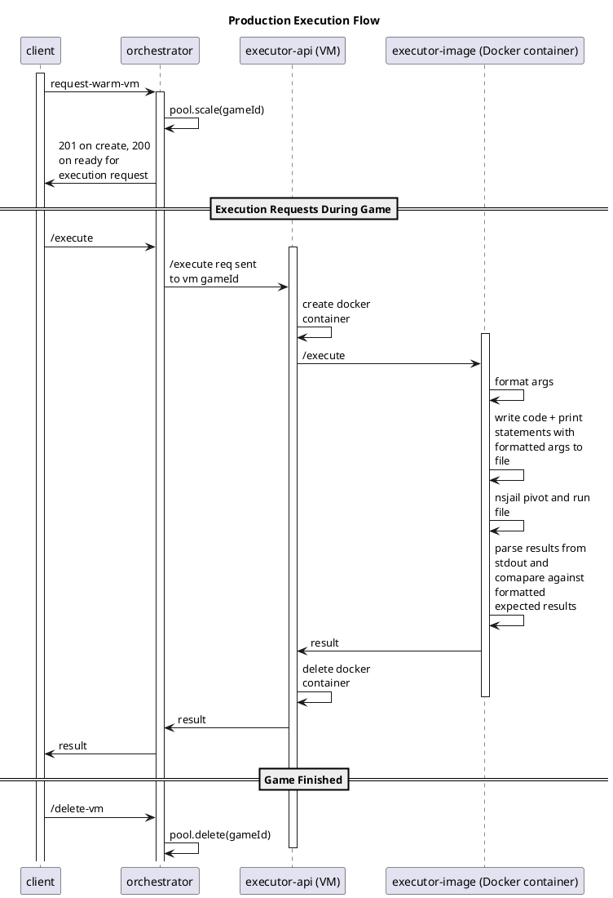

# Code Execution

## Local Execution
Locally, we have a small Docker container that runs with SYS_ADMIN and unconfined seccomp. They need the special permissions to run nsjail, which is essentially a container in itself, and thus must have access to the same linux namespace and cgroup primitives in the container as on the host.
We just use this container for every execution request for development - no other security methods are implemented are even necessary simply for development.

## Production Execution
Even with the rootjail, it's not enough for security. Reusing the containers is fine locally, but should not be done in production. Realistically, the attack surface is small enough that this *shouldn't* cause too much of an issue (especially as the executor should never be exposed, so all execution requests must go through our app and be subject to authentication and other requirements), but I would heavily recommend another layer of abstraction on top.

In GCP, we use VMs for this. The orchestrator takes a warm request and makes a VM as needed. Then that VM spins up instances of the Docker container for each execution request. It adds a little bit of overhead, but it's pretty minimal. The idea of this is that we can run the orchestrator in a Cloud Run Service such that when all VMs are destroyed and not in use, the service can scale to zero.

Future improvements for this include:
- Maintaining VM state in Redis so that the service can scale (right now, it is set to max of one instance).
- VM's should not be established per game. We did this as a quick way to get things working. We would prefer to keep a steady pool (say, one VM for every X concurrent games, not sure what the best formula should be) and route dynamically to the most readily available VM.
- The biggest issue for this right now is the cold start. The VMs all take about 45 seconds to come up, and if the user tries to submit code before that it simply will not run and will be lost to ether. This is best guarded against in the app.

## Prod Execution Flow
