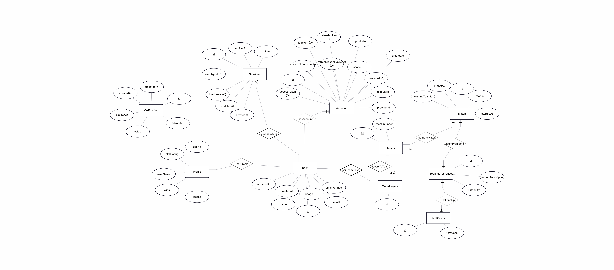
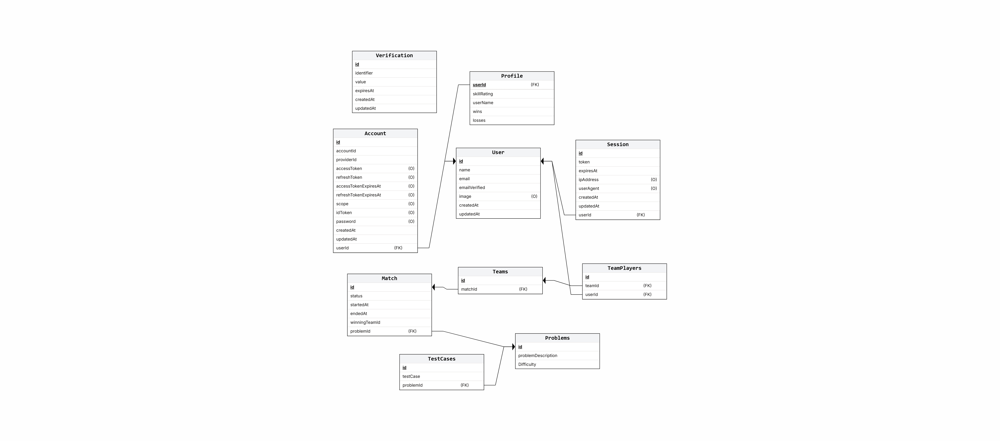

# Database Schema

## Overview
The database is preferred for authentication and persistence purposes. The initial design of the schema is imported from the `better-auth` library as that is being used for signing up and authenticating users to our platform. This includes tables: User, Account, Session, and Verification.
## PostgreSQL ERD

## PostgreSQL Relational Table
