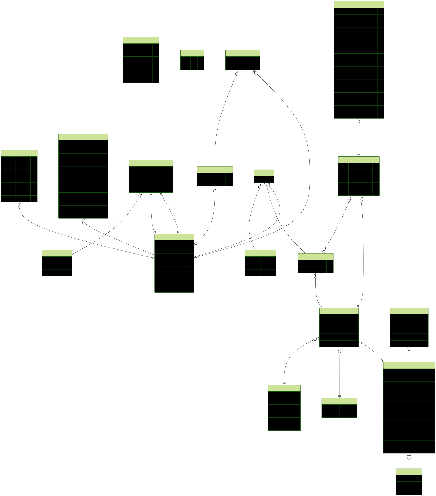

# Database Schema

## Overview
The database is preferred for authentication and persistence purposes. The initial design of the schema is imported from the `better-auth` library as that is being used for signing up and authenticating users to our platform. This includes tables: User, Account, Session, and Verification.

After that the database was expanded to allow for teams, game rooms, and results, further expanding to party and friendship systems as well.

## Tables

| Name | Description|
|...|...|
| `User` | Individual user |
| `Session` | Authenticated sessions for user |
| `Account` | Allows for multiple accounts under same user |
| `Verification` | Verification for better auth |
| `InfraTestKV` | Testing in Infra environment |
| `Friendship` | A friendship between two users, holds invite info as well |
| `Party` | Party system, each user has one party |
| `PartyMember` | Users who have joined someone else's party |
| `GameRoom` | Game information |
| `Team` | Team information |
| `TeamPlayer` | Users in teams information (role) |
| `Problem` | Problem information for the games |
| `ProblemTest` | "Hidden" test cases |
| `GameTest` | Saved test cases during game |
| `GameResult` | Final information for game |

## Enums

| Name | Description|
|...|...|
| `FriendshipStatus` | Whether friendship is active, declined, or in the invite step|
| `GameStatus` | Status of a game room |
| `GameType` | Type of game (two player vs four player) |
| `Role` | Coder, Tester, or Spectator |
| `ProblemDifficulty` | Easy, Medium, or Hard |

## PostgreSQL ERD
