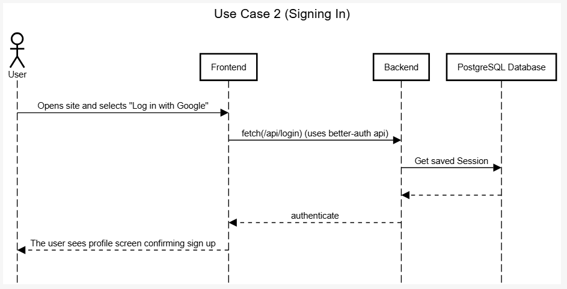
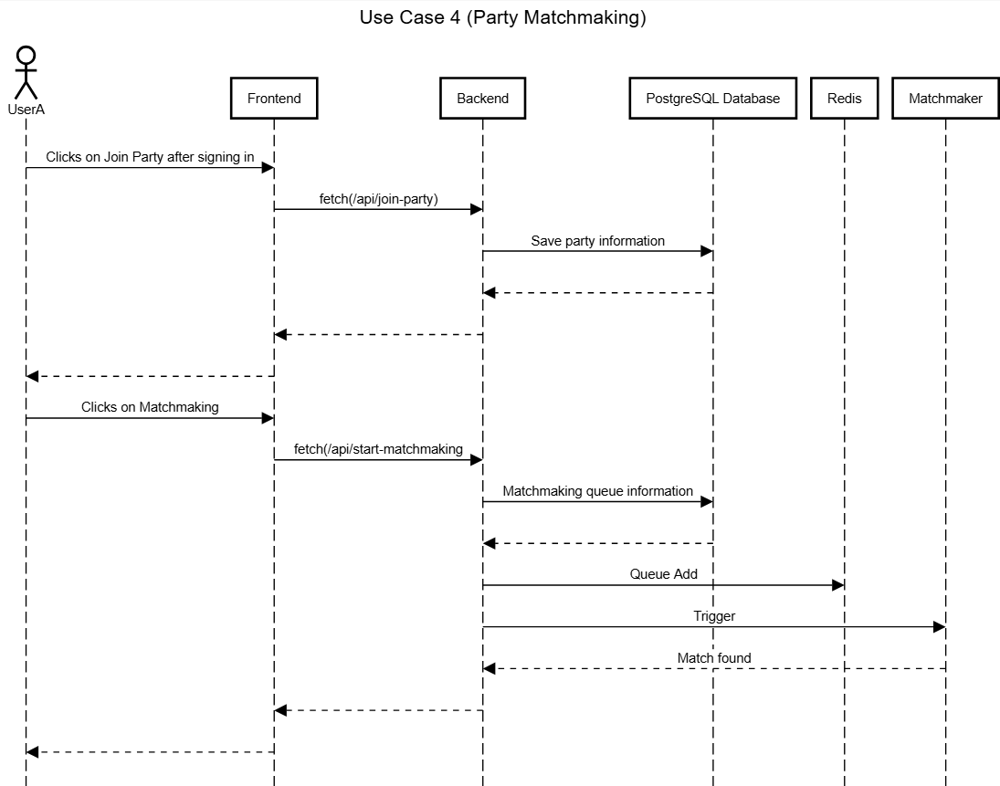
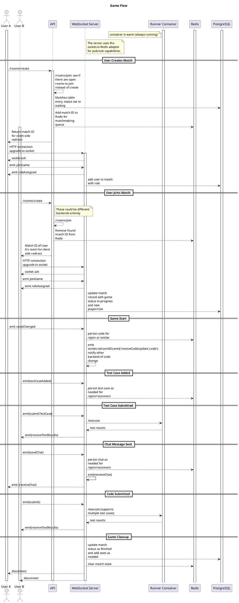

# Sequence Diagrams

## Use Case 1 (Account Creation)

## Use Case 2 (Signing In)

## Use Case 3 (Default Matchmaking)

## Use Case 4 (Party Matchmaking)

## Use Case 5 (Full Game Flow with Redis/websockets)
