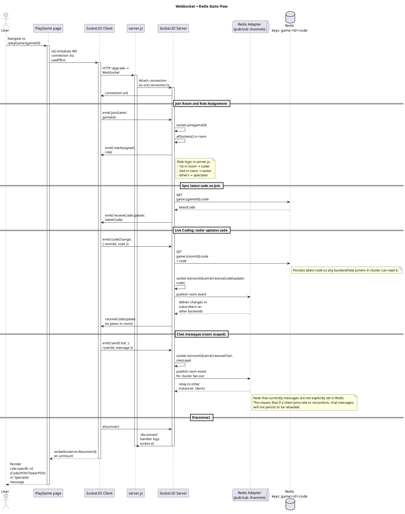

# Sequence Diagrams

## Use Case 1 (Account Creation)


## Use Case 2 (Signing In)


## Use Case 3 (Default Matchmaking)


## Use Case 4 (Party Matchmaking)


## Use Case 5 (Full Game Flow with Redis/websockets)


```plantuml-digram
@startuml
title Game Flow

skinparam participantPadding 20
skinparam boxPadding 10
skinparam shadowing false
skinparam sequenceArrowThickness 1
skinparam maxMessageSize 120

actor "User A" as ua
actor "User B" as ub
participant API as api
participant "WebSocket Server" as ws
participant Redis as rds
participant PostgreSQL as pg


note right of ws
The server uses the
socket.io Redis adapter
for pub/sub capabilities.
end note

== User Creates Match ==

ua --> api: /rooms/create
activate api
api --> api: /rooms/join: see if there are open rooms to join instead of create
api --> pg: Matches table entry, status set to waiting
activate pg
api --> rds: Add match ID to Redis for matchmaking queue
activate rds
api --> ua: Return match ID for client side redirect
ua --> ws: HTTP connection upgrade to socket
activate ws
ws --> ua: socket ack
ua --> ws: emit joinGame
ws --> ua: emit roleAssigned
ws --> pg: add user to match with role
deactivate api
deactivate ws

== User Joins Match ==
ub --> api: /rooms/create
activate api
note right of api
These could be different
backends entirely
end note
api --> api: /rooms/join
api --> rds: Remove found match ID from Redis
api --> ub: Match ID of User A's room for client side redirect
ub --> ws: HTTP connection upgrade to socket
ws --> ub: socket ack
ub --> ws: emit joinGame
ws --> ub: emit roleAssigned
ws --> pg: update match record with game status in-progress and new player/role
deactivate api
deactivate ws

== Game Start ==
ua --> ws: emit codeChanged
ws --> rds: persist code for rejoin or similar
ws --> ws: emit socket.to(roomID).emit('receiveCodeUpdate',code'): notify other backend of code change
ws --> ub: emit(receiveCodeUpdate, code)

` TODO: add testcase added, testcase ran, code submitted
@enduml
```