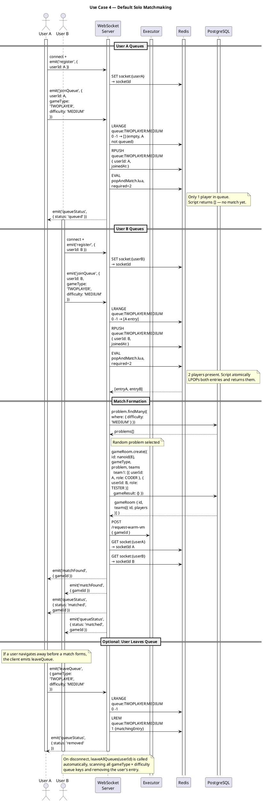
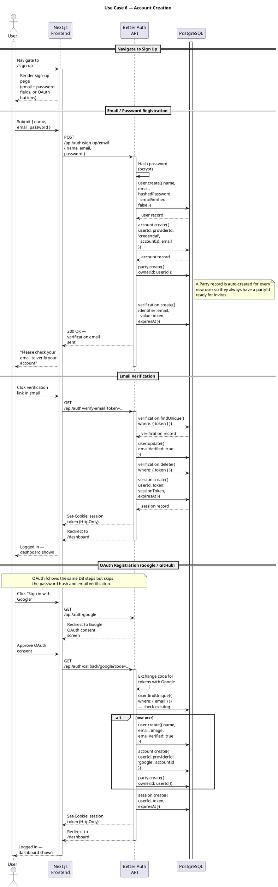
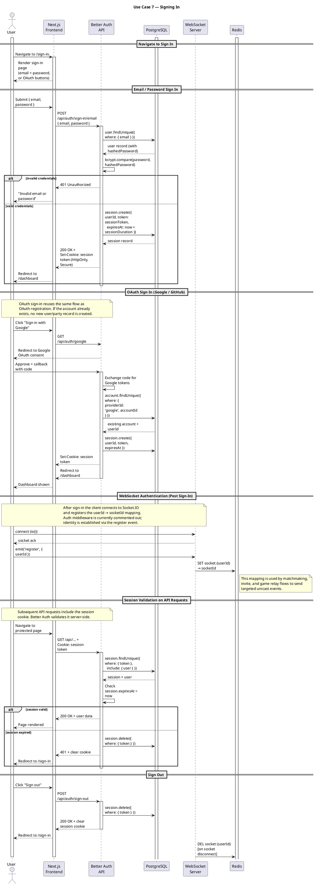

# Sequence Diagrams

## Use Case 1 — Full Game Flow (Redis / WebSockets)

```plantuml
@startuml
title Use Case 1 — Full Game Flow

skinparam participantPadding 20
skinparam boxPadding 10
skinparam shadowing false
skinparam sequenceArrowThickness 1
skinparam maxMessageSize 120

actor "User A\n(Coder)" as ua
actor "User B\n(Tester)" as ub
participant "WebSocket\nServer" as ws
activate ws
participant "Executor" as ex
note left of ex
  VM is pre-warmed
  per game room
end note
activate ex
participant Redis as rds
activate rds
participant PostgreSQL as pg
activate pg
participant "Expiration\nListener" as el
activate el

note right of ws
  Socket.IO with Redis adapter.
  All rooms are cluster-aware.
end note

== Registration & Connection ==
activate ua
ua -> ws: connect + emit('register', { userId })
ws -> rds: SET socket:{userId} → socketId
ws --> ua: socket ack

activate ub
ub -> ws: connect + emit('register', { userId })
ws -> rds: SET socket:{userId} → socketId
ws --> ub: socket ack

== Matchmaking (Solo Queue) ==
ua -> ws: emit('joinQueue', { userId, gameType, difficulty })
ws -> rds: RPUSH queue:{gameType}:{difficulty} entry
ws -> rds: EVAL popAndMatch.lua — not enough players yet
ws --> ua: emit('queueStatus', { status: 'queued' })

ub -> ws: emit('joinQueue', { userId, gameType, difficulty })
ws -> rds: RPUSH queue:{gameType}:{difficulty} entry
ws -> rds: EVAL popAndMatch.lua — 2 players, match formed
ws -> pg: gameRoom.create({ teams, players, problem, gameResult })
pg --> ws: gameRoom record
ws -> ex: POST /request-warm-vm { gameId }
ws -> rds: GET socket:{userId} (per player)
ws --> ua: emit('matchFound', { gameId })
ws --> ub: emit('matchFound', { gameId })

== Lobby ==
ua -> ws: emit('joinLobby', { gameId })
ws -> ws: socket.join("{gameId}:lobby")
ws --> ua: emit('joinedLobby')

ub -> ws: emit('joinLobby', { gameId })
ws -> ws: socket.join("{gameId}:lobby")
ws --> ub: emit('joinedLobby')

ua -> ws: emit('requestTeamUpdate', { teamId, gameId, playerCount: 1 })
ws --> ua: emit('teamUpdated', { teamId, playerCount: 1 }) [lobby broadcast]
ws --> ub: emit('teamUpdated', { teamId, playerCount: 1 })

ub -> ws: emit('requestTeamUpdate', { teamId, gameId, playerCount: 2 })
ws --> ua: emit('teamUpdated', { teamId, playerCount: 2 })
ws --> ub: emit('teamUpdated', { teamId, playerCount: 2 })

== Joining the Game Room ==
ua -> ws: emit('joinGame', { gameId, teamId, gameType })
ws -> ws: socket.join(gameId), socket.join(teamId), leave lobby
ws -> rds: EXISTS game:{gameId}:expires → 0 (not started)
note right of ws: Player count not yet at threshold

ub -> ws: emit('joinGame', { gameId, teamId, gameType })
ws -> ws: socket.join(gameId), socket.join(teamId)
ws -> rds: EXISTS game:{gameId}:expires → 0
note right of ws: Now 2 players — threshold met
ws --> ua: emit('gameStarting') [room broadcast]
ws --> ub: emit('gameStarting')

note over ws: waits 3 seconds

ws -> rds: SET game:{gameId}:expires '1' PX 300000 NX
ws -> rds: SET game:{gameId}:roleswap '1' PX {rand 30–70%} NX
ws -> rds: SET game:{gameId}:roleswap:warning '1' PX {roleswap − 60s} NX
ws -> rds: SADD activeGames gameId
ws --> ua: emit('gameStarted', { start: remainingMs, _duration: 300000 })
ws --> ub: emit('gameStarted', { start: remainingMs, _duration: 300000 })

== Game Play ==
ua -> ws: emit('codeChange', { teamId, code })
ws -> rds: SET game:{teamId}:code code
ws --> ub: emit('receiveCodeUpdate', code) [team broadcast excl. sender]

ub -> ws: emit('updateTestCases', { teamId, testCases })
ws -> rds: SET testcases:{teamId} JSON(testCases)
ws --> ua: emit('receiveTestCaseSync', testCases)

ub -> ws: emit('submitTestCases', { roomId, code, testCases, runIDs })
ws -> ex: POST /execute { gameId, language, code(b64), testCases }
ex --> ws: { results: [{ id, actual, passed, stderr }] }
ws --> ub: emit('receiveTestCaseSync', mappedResults) [team broadcast]
ws --> ua: emit('receiveTestCaseSync', mappedResults)

ub -> ws: emit('sendChat', { teamId, message })
ws -> rds: RPUSH chat:{teamId} message
ws -> rds: LTRIM chat:{teamId} -50 -1
ws --> ua: emit('receiveChat', message) [team broadcast excl. sender]

== Role Swap Warning ==
rds -> el: key expired: game:{gameId}:roleswap:warning
el --> ua: emit('roleSwapWarning') [room broadcast]
el --> ub: emit('roleSwapWarning')

== Role Swap ==
rds -> el: key expired: game:{gameId}:roleswap
el --> ua: emit('roleSwapping') [room broadcast]
el --> ub: emit('roleSwapping')
el -> rds: SET lock:game:{gameId}:roleswap NX PX 5000
el -> rds: SISMEMBER activeGames gameId → true
el -> pg: team.findMany({ where: { gameRoomId } })
note over el: waits 2500 ms
el -> pg: teamPlayer.updateMany(CODER → SPECTATOR)
el -> pg: teamPlayer.updateMany(TESTER → CODER)
el -> pg: teamPlayer.updateMany(SPECTATOR → TESTER)
el --> ua: emit('roleSwap') [team broadcast]
el --> ub: emit('roleSwap')

note over ua, ub: Roles are now swapped. User A is Tester, User B is Coder.

== Code Submission ==
ub -> ws: emit('submitCode', { roomId, code, type: 'TWOPLAYER', submitTime })
ws -> pg: gameResult.findUnique + gameRoom.findUnique
ws -> pg: gameResult.update({ team1Code, team1SubmittedAt })
ws -> rds: GET testcases:{team1Id}
ws -> pg: problemTest.findMany (hidden tests)
ws -> ex: POST /execute (game + hidden test cases)
ex --> ws: { results[] }
ws -> pg: $transaction(gameTest.upsert × N)
ws -> rds: DEL game:{gameId}:expires / roleswap / roleswap:warning
ws -> rds: SREM activeGames gameId
ws -> pg: gameRoom.update({ status: FINISHED })
ws --> ua: emit('gameEnded') [room broadcast]
ws --> ub: emit('gameEnded')
ws -> rds: GET socket:{userId} per player
ws -> ws: socketsLeave([gameId, teamId]) per player
ws -> ex: POST /delete-vm { gameId }

deactivate ua
deactivate ub
deactivate ws
deactivate el
@enduml
```

---

## Use Case 2 — Perfect Game Flow

```plantuml
@startuml
title Use Case 2 — Perfect Game Flow

skinparam participantPadding 20
skinparam boxPadding 10
skinparam shadowing false
skinparam sequenceArrowThickness 1
skinparam maxMessageSize 120

actor "User A\n(Coder)" as ua
actor "User B\n(Tester)" as ub
participant "WebSocket\nServer" as ws
activate ws
participant "Executor" as ex
activate ex
participant Redis as rds
activate rds
participant PostgreSQL as pg
activate pg

== Connection & Match Found ==
activate ua
activate ub
ua -> ws: connect + emit('register', { userId })
ws -> rds: SET socket:{userId} → socketId
ub -> ws: connect + emit('register', { userId })
ws -> rds: SET socket:{userId} → socketId

note over ua, ub
  Matchmaking queues and match formation
  as described in Use Case 1.
  Both players receive matchFound + joinGame.
end note

ws --> ua: emit('matchFound', { gameId })
ws --> ub: emit('matchFound', { gameId })

ua -> ws: emit('joinGame', { gameId, teamId, gameType })
ub -> ws: emit('joinGame', { gameId, teamId, gameType })

ws -> rds: SET game:{gameId}:expires NX PX 300000
ws -> rds: SET game:{gameId}:roleswap NX PX {rand}
ws -> rds: SET game:{gameId}:roleswap:warning NX PX {rand − 60s}
ws -> rds: SADD activeGames gameId
ws --> ua: emit('gameStarted', { start, _duration })
ws --> ub: emit('gameStarted', { start, _duration })

== Coder Writes Solution ==
ua -> ws: emit('codeChange', { teamId, code })
ws -> rds: SET game:{teamId}:code code
ws --> ub: emit('receiveCodeUpdate', code)

ua -> ws: emit('codeChange', { teamId, code }) [multiple iterations]
ws -> rds: SET game:{teamId}:code code
ws --> ub: emit('receiveCodeUpdate', code)

== Tester Builds & Runs Test Cases ==
ub -> ws: emit('updateTestCases', { teamId, testCases })
ws -> rds: SET testcases:{teamId} JSON(testCases)
ws --> ua: emit('receiveTestCaseSync', testCases)

ub -> ws: emit('submitTestCases', { roomId, code, testCases, runIDs })
ws -> ex: POST /execute { gameId, language, code(b64), testCases }
ex --> ws: { results: [{ actual, passed: true, ... }] }
note right of ex: All tests passing!
ws --> ub: emit('receiveTestCaseSync', mappedResults)
ws --> ua: emit('receiveTestCaseSync', mappedResults)

== Final Submission (Before Role Swap) ==
note over ua, ub
  Game ends before the role-swap timer fires.
  No roleSwapWarning or roleSwap is emitted.
end note

ub -> ws: emit('submitCode', { roomId, code, type: 'TWOPLAYER', submitTime })
ws -> pg: gameResult.findUnique + gameRoom.findUnique
ws -> pg: gameResult.update({ team1Code, team1SubmittedAt })
ws -> rds: GET testcases:{team1Id}
ws -> pg: problemTest.findMany (hidden tests)
ws -> ex: POST /execute (game tests + hidden tests)
ex --> ws: { results[] } — all passing
ws -> pg: $transaction(gameTest.upsert × N)

== Cleanup ==
ws -> rds: DEL game:{gameId}:expires / roleswap / roleswap:warning
ws -> rds: SREM activeGames gameId
ws -> pg: gameRoom.update({ status: FINISHED })
ws --> ua: emit('gameEnded') [room broadcast]
ws --> ub: emit('gameEnded')
ws -> rds: GET socket:{userId} per player
ws -> ws: socketsLeave([gameId, teamId]) per player
ws -> ex: POST /delete-vm { gameId }

deactivate ua
deactivate ub
deactivate ws
@enduml
```

---

## Use Case 3 — Worst-Case Game Flow (Timer Expiry)

```plantuml
@startuml
title Use Case 3 — Worst-Case Game Flow (Timer Expiry)

skinparam participantPadding 20
skinparam boxPadding 10
skinparam shadowing false
skinparam sequenceArrowThickness 1
skinparam maxMessageSize 120

actor "User A\n(Coder → Tester)" as ua
actor "User B\n(Tester → Coder)" as ub
participant "WebSocket\nServer" as ws
activate ws
participant "Executor" as ex
activate ex
participant Redis as rds
activate rds
participant PostgreSQL as pg
activate pg
participant "Expiration\nListener" as el
activate el

== Connection & Game Start ==
activate ua
activate ub

note over ua, ub
  Match found, lobby joined, joinGame emitted.
  See Use Case 1 for full matchmaking + join flow.
end note

ws -> rds: SET game:{gameId}:expires NX PX 300000
ws -> rds: SET game:{gameId}:roleswap NX PX {rand 30–70% of 300s}
ws -> rds: SET game:{gameId}:roleswap:warning NX PX {roleswap − 60s}
ws -> rds: SADD activeGames gameId
ws --> ua: emit('gameStarted', { start, _duration })
ws --> ub: emit('gameStarted', { start, _duration })

== First Half — Tests Failing ==
ua -> ws: emit('codeChange', { teamId, code })
ws -> rds: SET game:{teamId}:code code
ws --> ub: emit('receiveCodeUpdate', code)

ub -> ws: emit('updateTestCases', { teamId, testCases })
ws -> rds: SET testcases:{teamId} JSON(testCases)
ws --> ua: emit('receiveTestCaseSync', testCases)

ub -> ws: emit('submitTestCases', { roomId, code, testCases, runIDs })
ws -> ex: POST /execute
ex --> ws: { results: [{ passed: false, ... }] }
note right of ex: Tests are failing.
ws --> ub: emit('receiveTestCaseSync', failingResults)
ws --> ua: emit('receiveTestCaseSync', failingResults)

== Role Swap Warning ==
rds -> el: key expired: game:{gameId}:roleswap:warning
el --> ua: emit('roleSwapWarning') [room broadcast]
el --> ub: emit('roleSwapWarning')
note over ua, ub: UI shows countdown — role swap in 60 s

== Role Swap ==
rds -> el: key expired: game:{gameId}:roleswap
el --> ua: emit('roleSwapping') [room broadcast]
el --> ub: emit('roleSwapping')
el -> rds: SET lock:game:{gameId}:roleswap NX PX 5000 → acquired
el -> rds: SISMEMBER activeGames gameId → 1
el -> pg: team.findMany({ where: { gameRoomId } }) → teamIds
note over el: waits 2500 ms for frontend animation
el -> pg: teamPlayer.updateMany(CODER → SPECTATOR)
el -> pg: teamPlayer.updateMany(TESTER → CODER)
el -> pg: teamPlayer.updateMany(SPECTATOR → TESTER)
el --> ua: emit('roleSwap') [per team broadcast]
el --> ub: emit('roleSwap')

note over ua, ub: User A is now Tester. User B is now Coder.

== Second Half — Still Failing ==
ub -> ws: emit('codeChange', { teamId, code })
ws -> rds: SET game:{teamId}:code code
ws --> ua: emit('receiveCodeUpdate', code)

ua -> ws: emit('updateTestCases', { teamId, testCases })
ws -> rds: SET testcases:{teamId} JSON(testCases)
ws --> ub: emit('receiveTestCaseSync', testCases)

ua -> ws: emit('submitTestCases', { roomId, code, testCases, runIDs })
ws -> ex: POST /execute
ex --> ws: { results: [{ passed: false, ... }] }
ws --> ua: emit('receiveTestCaseSync', failingResults)
ws --> ub: emit('receiveTestCaseSync', failingResults)

== Timer Runs Out ==
rds -> el: key expired: game:{gameId}:expires
el -> rds: SET lock:game:{gameId}:end NX PX 5000 → acquired
el -> rds: SISMEMBER activeGames gameId → 1
el -> pg: gameRoom.update({ status: FINISHED })
el -> rds: SREM activeGames gameId
el --> ua: emit('gameEnded') [room broadcast]
el --> ub: emit('gameEnded')

note over ua, ub
  No code execution on timer expiry —
  game ends with whatever is persisted.
  Results API reads from GameTest records.
end note

== Cleanup ==
ws -> rds: GET socket:{userId} per player
ws -> ws: socketsLeave([gameId, teamId]) per player

deactivate ua
deactivate ub
deactivate ws
deactivate el
@enduml
```

---

## Use Case 4 — Default Solo Matchmaking

```plantuml
@startuml
title Use Case 4 — Default Solo Matchmaking

skinparam participantPadding 20
skinparam boxPadding 10
skinparam shadowing false
skinparam sequenceArrowThickness 1
skinparam maxMessageSize 120

actor "User A" as ua
actor "User B" as ub
participant "WebSocket\nServer" as ws
activate ws
participant "Executor" as ex
activate ex
participant Redis as rds
activate rds
participant PostgreSQL as pg
activate pg

== User A Queues ==
activate ua
ua -> ws: connect + emit('register', { userId: A })
ws -> rds: SET socket:{userA} → socketId

ua -> ws: emit('joinQueue', { userId: A, gameType: 'TWOPLAYER', difficulty: 'MEDIUM' })
ws -> rds: LRANGE queue:TWOPLAYER:MEDIUM 0 -1 → [] (empty, A not queued)
ws -> rds: RPUSH queue:TWOPLAYER:MEDIUM { userId: A, joinedAt }
ws -> rds: EVAL popAndMatch.lua, required=2
note right of rds
  Only 1 player in queue.
  Script returns [] — no match yet.
end note
ws --> ua: emit('queueStatus', { status: 'queued' })

== User B Queues ==
activate ub
ub -> ws: connect + emit('register', { userId: B })
ws -> rds: SET socket:{userB} → socketId

ub -> ws: emit('joinQueue', { userId: B, gameType: 'TWOPLAYER', difficulty: 'MEDIUM' })
ws -> rds: LRANGE queue:TWOPLAYER:MEDIUM 0 -1 → [A entry]
ws -> rds: RPUSH queue:TWOPLAYER:MEDIUM { userId: B, joinedAt }
ws -> rds: EVAL popAndMatch.lua, required=2
note right of rds
  2 players present. Script atomically
  LPOPs both entries and returns them.
end note
rds --> ws: [entryA, entryB]

== Match Formation ==
ws -> pg: problem.findMany({ where: { difficulty: 'MEDIUM' } })
pg --> ws: problems[]
note right of ws: Random problem selected
ws -> pg: gameRoom.create({ id: nanoid(8), gameType, problem, teams\n  team1: [{ userId: A, role: CODER }, { userId: B, role: TESTER }]\n  gameResult: {} })
pg --> ws: gameRoom { id, teams[{ id, players }] }
ws -> ex: POST /request-warm-vm { gameId }
ws -> rds: GET socket:{userA} → socketId A
ws -> rds: GET socket:{userB} → socketId B
ws --> ua: emit('matchFound', { gameId })
ws --> ub: emit('matchFound', { gameId })

ws --> ua: emit('queueStatus', { status: 'matched', gameId })
ws --> ub: emit('queueStatus', { status: 'matched', gameId })

== Optional: User Leaves Queue ==
note over ua
  If a user navigates away before a match forms,
  the client emits leaveQueue.
end note
ua -> ws: emit('leaveQueue', { gameType: 'TWOPLAYER', difficulty: 'MEDIUM' })
ws -> rds: LRANGE queue:TWOPLAYER:MEDIUM 0 -1
ws -> rds: LREM queue:TWOPLAYER:MEDIUM 1 {matchingEntry}
ws --> ua: emit('queueStatus', { status: 'removed' })

note over ws
  On disconnect, leaveAllQueues(userId) is called
  automatically, scanning all gameType × difficulty
  queue keys and removing the user's entry.
end note

deactivate ua
deactivate ub
deactivate ws
@enduml
```

---

## Use Case 5 — Party Matchmaking

```plantuml
@startuml
title Use Case 5 — Party Matchmaking

skinparam participantPadding 20
skinparam boxPadding 10
skinparam shadowing false
skinparam sequenceArrowThickness 1
skinparam maxMessageSize 120

actor "User A\n(Party Owner)" as ua
actor "User B\n(Invitee)" as ub
participant "WebSocket\nServer" as ws
activate ws
participant "Executor" as ex
activate ex
participant Redis as rds
activate rds
participant PostgreSQL as pg
activate pg

== Connection ==
activate ua
activate ub
ua -> ws: connect + emit('register', { userId: A })
ws -> rds: SET socket:{userA} → socketId
ub -> ws: connect + emit('register', { userId: B })
ws -> rds: SET socket:{userB} → socketId

== Party Invite Flow ==
ua -> ws: emit('partyInvite', { toUserId: B })
ws -> pg: party.findFirst({ where: { ownerId: A }, include: { member } })
note right of pg: Checks party exists and has no member yet
ws -> pg: user.findUnique(A) + user.findUnique(B)
ws -> rds: SET party:invite:{userB} JSON(invite) EX 60
ws -> rds: GET socket:{userB} → socketId B
ws --> ub: emit('partyInviteReceived', { fromUserId: A, fromDisplayName, partyOwnerId: A, sentAt })

ub -> ws: emit('partyInviteAccept')
ws -> rds: GET party:invite:{userB} → invite JSON
ws -> pg: party.findFirst({ where: { ownerId: A }, include: { member, owner } })
ws -> pg: partyMember.create({ partyId, userId: B })
ws -> rds: DEL party:invite:{userB}
ws --> ub: emit('partyJoined', { userId: A, username, displayName, avatarUrl })
ws -> rds: GET socket:{userA} → socketId A
ws --> ua: emit('partyMemberJoined', { userId: B, username, displayName, avatarUrl, joinedAt })

note over ua, ub: Both players are now in a party together.

== Alternative: Join by Party Code ==
note over ub
  Instead of an invite, User B can enter
  User A's party ID directly as a code.
end note
ub -> ws: emit('partyJoinByCode', { code: partyId })
ws -> pg: party.findUnique({ where: { id: code }, include: { member, owner } })
note right of pg: Validates: exists, not own party, not full
ws -> pg: partyMember.create({ partyId, userId: B })
ws --> ub: emit('partyJoined', ownerShape)
ws -> rds: GET socket:{userA}
ws --> ua: emit('partyMemberJoined', memberShape)

== Queue as a Party (TWOPLAYER) ==
note over ua, ub
  For TWOPLAYER, a party bypasses the queue
  entirely and forms an instant game.
end note

ua -> ws: emit('joinQueue', { userId: A, gameType: 'TWOPLAYER', difficulty: 'EASY', partyId })
ws -> pg: party.findUnique({ where: { id: partyId }, include: { owner, member } })
note right of pg: Validates party is full (has both members)
ws -> pg: problem.findMany({ where: { difficulty: 'EASY' } })
ws -> pg: gameRoom.create({ id: nanoid(8), gameType, problem, teams\n  team1: [{ userId: A, role: CODER }, { userId: B, role: TESTER }]\n  gameResult: {} })
pg --> ws: gameRoom
ws -> ex: POST /request-warm-vm { gameId }
ws -> rds: GET socket:{userA} → socketId A
ws -> rds: GET socket:{userB} → socketId B
ws --> ua: emit('matchFound', { gameId })
ws --> ub: emit('matchFound', { gameId })
ws --> ua: emit('queueStatus', { status: 'matched', gameId })

== Queue as a Party (FOURPLAYER) ==
note over ua, ub
  For FOURPLAYER, the party is pushed to the queue
  as a single 2-player entry (counted as 2 slots).
end note
ua -> ws: emit('joinQueue', { userId: A, gameType: 'FOURPLAYER', difficulty: 'HARD', partyId })
ws -> rds: RPUSH queue:FOURPLAYER:HARD { partyId, joinedAt }
ws -> rds: EVAL popAndMatch.lua, required=4
note right of rds
  Party entry counts as 2 players.
  If only 2 more solo players are present,
  the match forms. Script expands partyId
  to [owner, member] via DB lookup.
end note
ws --> ua: emit('queueStatus', { status: 'queued' })

== Queue Selection Relay ==
ua -> ws: emit('updateQueueSelection', { gameType, difficulty, partyMember: { userId: B } })
ws -> rds: GET socket:{userB}
ws --> ub: emit('receiveQueueSelection', { gameType, difficulty })

ua -> ws: emit('partySearch', { partyMember: { userId: B }, state: true })
ws -> rds: GET socket:{userB}
ws --> ub: emit('partySearchUpdate', { state: true })

== Party Management ==
note over ua, ub: Owner can kick; member can leave at any time.

ua -> ws: emit('partyKick')
ws -> pg: party.findFirst({ where: { ownerId: A }, include: { member } })
ws -> pg: partyMember.delete({ where: { partyId } })
ws -> rds: GET socket:{userB}
ws --> ub: emit('joinedPartyLeft')

ub -> ws: emit('partyLeave')
ws -> pg: partyMember.findUnique({ where: { userId: B }, include: { party } })
ws -> pg: partyMember.delete({ where: { userId: B } })
ws -> rds: GET socket:{userA}
ws --> ua: emit('partyMemberLeft')

deactivate ua
deactivate ub
deactivate ws
@enduml
```

---

## Use Case 6 — Account Creation

```plantuml
@startuml
title Use Case 6 — Account Creation

skinparam participantPadding 20
skinparam boxPadding 10
skinparam shadowing false
skinparam sequenceArrowThickness 1
skinparam maxMessageSize 120

actor "User" as u
participant "Next.js\nFrontend" as fe
participant "Better Auth\nAPI" as auth
participant PostgreSQL as pg
activate pg

== Navigate to Sign Up ==
activate u
u -> fe: Navigate to /sign-up
activate fe
fe --> u: Render sign-up page\n(email + password fields, or OAuth buttons)

== Email / Password Registration ==
u -> fe: Submit { name, email, password }
fe -> auth: POST /api/auth/sign-up/email\n{ name, email, password }
activate auth
auth -> auth: Hash password (bcrypt)
auth -> pg: user.create({ name, email, hashedPassword,\n  emailVerified: false })
pg --> auth: user record
auth -> pg: account.create({ userId, providerId: 'credential',\n  accountId: email })
pg --> auth: account record
auth -> pg: party.create({ ownerId: userId })
note right of pg
  A Party record is auto-created for every
  new user so they always have a partyId
  ready for invites.
end note
auth -> pg: verification.create({ identifier: email,\n  value: token, expiresAt })
auth --> fe: 200 OK — verification email sent
fe --> u: "Please check your email to verify your account"
deactivate auth

== Email Verification ==
u -> fe: Click verification link in email
fe -> auth: GET /api/auth/verify-email?token=...
activate auth
auth -> pg: verification.findUnique({ where: { token } })
pg --> auth: verification record
auth -> pg: user.update({ emailVerified: true })
auth -> pg: verification.delete({ where: { token } })
auth -> pg: session.create({ userId, token: sessionToken, expiresAt })
pg --> auth: session record
auth --> fe: Set-Cookie: session token (HttpOnly)
auth --> fe: Redirect to /dashboard
deactivate auth
fe --> u: Logged in — dashboard shown

== OAuth Registration (Google / GitHub) ==
note over u, auth
  OAuth follows the same DB steps but skips
  the password hash and email verification.
end note
u -> fe: Click "Sign in with Google"
fe -> auth: GET /api/auth/google
auth --> fe: Redirect to Google OAuth consent screen
u -> fe: Approve OAuth consent
fe -> auth: GET /api/auth/callback/google?code=...
activate auth
auth -> auth: Exchange code for tokens with Google
auth -> pg: user.findUnique({ where: { email } }) — check existing
alt new user
  auth -> pg: user.create({ name, email, image, emailVerified: true })
  auth -> pg: account.create({ userId, providerId: 'google', accountId })
  auth -> pg: party.create({ ownerId: userId })
end
auth -> pg: session.create({ userId, token, expiresAt })
auth --> fe: Set-Cookie: session token (HttpOnly)
auth --> fe: Redirect to /dashboard
deactivate auth
fe --> u: Logged in — dashboard shown

deactivate fe
deactivate u
@enduml
```

---

## Use Case 7 — Signing In

```plantuml
@startuml
title Use Case 7 — Signing In

skinparam participantPadding 20
skinparam boxPadding 10
skinparam shadowing false
skinparam sequenceArrowThickness 1
skinparam maxMessageSize 120

actor "User" as u
participant "Next.js\nFrontend" as fe
participant "Better Auth\nAPI" as auth
participant PostgreSQL as pg
activate pg
participant "WebSocket\nServer" as ws
participant Redis as rds
activate rds

== Navigate to Sign In ==
activate u
u -> fe: Navigate to /sign-in
activate fe
fe --> u: Render sign-in page\n(email + password, or OAuth buttons)

== Email / Password Sign In ==
u -> fe: Submit { email, password }
fe -> auth: POST /api/auth/sign-in/email\n{ email, password }
activate auth
auth -> pg: user.findUnique({ where: { email } })
pg --> auth: user record (with hashedPassword)
auth -> auth: bcrypt.compare(password, hashedPassword)

alt invalid credentials
  auth --> fe: 401 Unauthorized
  fe --> u: "Invalid email or password"
else valid credentials
  auth -> pg: session.create({ userId, token: sessionToken,\n  expiresAt: now + sessionDuration })
  pg --> auth: session record
  auth --> fe: 200 OK + Set-Cookie: session token (HttpOnly, Secure)
  fe --> u: Redirect to /dashboard
end
deactivate auth

== OAuth Sign In (Google / GitHub) ==
note over u, auth
  OAuth sign-in reuses the same flow as
  OAuth registration. If the account already
  exists, no new user/party record is created.
end note
u -> fe: Click "Sign in with Google"
fe -> auth: GET /api/auth/google
auth --> u: Redirect to Google OAuth consent
u -> auth: Approve + callback with code
activate auth
auth -> auth: Exchange code for Google tokens
auth -> pg: account.findUnique({ where: { providerId: 'google', accountId } })
pg --> auth: existing account + userId
auth -> pg: session.create({ userId, token, expiresAt })
auth --> fe: Set-Cookie: session token
auth --> fe: Redirect to /dashboard
deactivate auth
fe --> u: Dashboard shown

== WebSocket Authentication (Post Sign-In) ==
note over u, ws
  After sign-in the client connects to Socket.IO
  and registers the userId → socketId mapping.
  Auth middleware is currently commented out;
  identity is established via the register event.
end note
u -> ws: connect (io())
ws --> u: socket ack
u -> ws: emit('register', { userId })
ws -> rds: SET socket:{userId} → socketId
note right of rds
  This mapping is used by matchmaking,
  invite, and game relay flows to send
  targeted unicast events.
end note

== Session Validation on API Requests ==
note over u, auth
  Subsequent API requests include the session
  cookie. Better Auth validates it server-side.
end note
u -> fe: Navigate to protected page
fe -> auth: GET /api/... + Cookie: session token
activate auth
auth -> pg: session.findUnique({ where: { token },\n  include: { user } })
pg --> auth: session + user
auth -> auth: Check session.expiresAt > now
alt session valid
  auth --> fe: 200 OK + user data
  fe --> u: Page rendered
else session expired
  auth -> pg: session.delete({ where: { token } })
  auth --> fe: 401 + clear cookie
  fe --> u: Redirect to /sign-in
end
deactivate auth

== Sign Out ==
u -> fe: Click "Sign out"
fe -> auth: POST /api/auth/sign-out
activate auth
auth -> pg: session.delete({ where: { token } })
auth --> fe: 200 OK + clear session cookie
deactivate auth
fe --> u: Redirect to /sign-in
ws -> rds: DEL socket:{userId} [on socket disconnect]

deactivate fe
deactivate u
@enduml
```