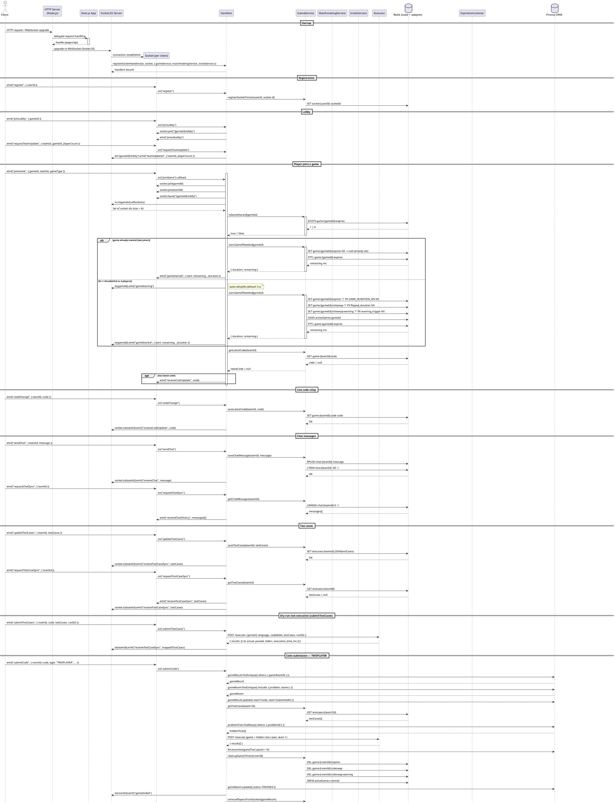

# Serverflow

```plantuml-diagram
@startuml
' Code BattleGrounds - Server Sequence Diagram
' Shows flow when the server receives socket signals and timer interactions

skinparam linetype polyline
hide footbox

actor Client
participant "HTTP Server\n(Node.js)" as Http
participant "Next.js App" as Next
participant "Socket.IO Server" as IO
participant "Socket (per client)" as Sock
participant "Handlers" as H
participant "GameService" as GS
participant "MatchmakingService" as MS
participant "InviteService" as IS
participant "Executor" as EX
database "Redis (state + adapter)" as R
participant "ExpirationListener" as EL
database "Prisma ORM" as PR

== Startup ==
Client -> Http : HTTP request / WebSocket upgrade
Http -> Next : delegate request handling
activate Next
Next --> Http : handle (pages/api)
deactivate Next

Http -> IO : upgrade to WebSocket (Socket.IO)
create Sock
IO -> Sock : connection established
IO -> H : registerSocketHandlers(io, socket, { gameService, matchmakingService, inviteService })
H --> IO : handlers bound

' ─────────────────────────────────────────────
== Registration ==
' ─────────────────────────────────────────────
Client -> Sock : emit("register", { userId })
Sock -> H : on("register")
H -> GS : registerSocketToUser(userId, socket.id)
GS -> R : SET socket:{userId} socketId

' ─────────────────────────────────────────────
== Lobby ==
' ─────────────────────────────────────────────
Client -> Sock : emit("joinLobby", { gameId })
Sock -> H : on("joinLobby")
H -> Sock : socket.join("{gameId}:lobby")
H -> Sock : emit("joinedLobby")

Client -> Sock : emit("requestTeamUpdate", { teamId, gameId, playerCount })
Sock -> H : on("requestTeamUpdate")
H -> IO : to("{gameId}:lobby").emit("teamUpdated", { teamId, playerCount })

' ─────────────────────────────────────────────
== Player joins a game ==
' ─────────────────────────────────────────────
Client -> Sock : emit("joinGame", { gameId, teamId, gameType })
activate H
Sock -> H : on("joinGame") callback
H -> Sock : socket.join(gameId)
H -> Sock : socket.join(teamId)
H -> Sock : socket.leave("{gameId}:lobby")
H -> IO : io.in(gameId).allSockets()
IO --> H : Set of socket ids (size = N)
H -> GS : isGameStarted(gameId)
activate GS
GS -> R : EXISTS game:{gameId}:expires
R --> GS : 1 | 0
GS --> H : true | false
deactivate GS

alt game already started (late joiner)
  H -> GS : startGameIfNeeded(gameId)
  activate GS
  GS -> R : SET game:{gameId}:expires NX → null (already set)
  GS -> R : PTTL game:{gameId}:expires
  R --> GS : remaining ms
  GS --> H : { duration, remaining }
  deactivate GS
  H -> Sock : emit("gameStarted", { start: remaining, _duration })

else N == threshold (2 or 4 players)
  H -> IO : to(gameId).emit("gameStarting")
  note right : waits delayMs (default 3 s)
  H -> GS : startGameIfNeeded(gameId)
  activate GS
  GS -> R : SET game:{gameId}:expires '1' PX GAME_DURATION_MS NX
  GS -> R : SET game:{gameId}:roleswap '1' PX flipped_duration NX
  GS -> R : SET game:{gameId}:roleswap:warning '1' PX warning_trigger NX
  GS -> R : SADD activeGames gameId
  GS -> R : PTTL game:{gameId}:expires
  R --> GS : remaining ms
  GS --> H : { duration, remaining }
  deactivate GS
  H -> IO : to(gameId).emit("gameStarted", { start: remaining, _duration })
end

H -> GS : getLatestCode(teamId)
GS -> R : GET game:{teamId}:code
R --> GS : code | null
GS --> H : latestCode | null
opt has latest code
  H -> Sock : emit("receiveCodeUpdate", code)
end
deactivate H

' ─────────────────────────────────────────────
== Live code relay ==
' ─────────────────────────────────────────────
Client -> Sock : emit("codeChange", { teamId, code })
Sock -> H : on("codeChange")
H -> GS : saveLatestCode(teamId, code)
GS -> R : SET game:{teamId}:code code
R --> GS : OK
H -> IO : socket.to(teamId).emit("receiveCodeUpdate", code)

' ─────────────────────────────────────────────
== Chat messages ==
' ─────────────────────────────────────────────
Client -> Sock : emit("sendChat", { teamId, message })
Sock -> H : on("sendChat")
H -> GS : saveChatMessage(teamId, message)
GS -> R : RPUSH chat:{teamId} message
GS -> R : LTRIM chat:{teamId} -50 -1
R --> GS : OK
H -> IO : socket.to(teamId).emit("receiveChat", message)

Client -> Sock : emit("requestChatSync", { teamId })
Sock -> H : on("requestChatSync")
H -> GS : getChatMessages(teamId)
GS -> R : LRANGE chat:{teamId} 0 -1
R --> GS : messages[]
H -> Sock : emit("receiveChatHistory", messages[])

' ─────────────────────────────────────────────
== Test cases ==
' ─────────────────────────────────────────────
Client -> Sock : emit("updateTestCases", { teamId, testCases })
Sock -> H : on("updateTestCases")
H -> GS : saveTestCases(teamId, testCases)
GS -> R : SET testcases:{teamId} JSON(testCases)
R --> GS : OK
H -> IO : socket.to(teamId).emit("receiveTestCaseSync", testCases)

Client -> Sock : emit("requestTestCaseSync", { teamId })
Sock -> H : on("requestTestCaseSync")
H -> GS : getTestCases(teamId)
GS -> R : GET testcases:{teamId}
R --> GS : testCases | null
H -> Sock : emit("receiveTestCaseSync", testCases)
H -> IO : socket.to(teamId).emit("receiveTestCaseSync", testCases)

' ─────────────────────────────────────────────
== Dry-run test execution (submitTestCases) ==
' ─────────────────────────────────────────────
Client -> Sock : emit("submitTestCases", { roomId, code, testCases, runIDs })
Sock -> H : on("submitTestCases")
H -> EX : POST /execute { gameId, language, code(b64), testCases, runIDs }
EX --> H : { results: [{ id, actual, passed, stderr, execution_time_ms }] }
H -> IO : to(teamId).emit("receiveTestCaseSync", mappedTestCases)

' ─────────────────────────────────────────────
== Code submission — TWOPLAYER ==
' ─────────────────────────────────────────────
Client -> Sock : emit("submitCode", { roomId, code, type: "TWOPLAYER", ... })
Sock -> H : on("submitCode")
H -> PR : gameResult.findUnique({ where: { gameRoomId } })
PR --> H : gameResult
H -> PR : gameRoom.findUnique({ include: { problem, teams } })
PR --> H : gameRoom
H -> PR : gameResult.update({ team1Code, team1SubmittedAt })
H -> GS : getTestCases(team1Id)
GS -> R : GET testcases:{team1Id}
R --> GS : testCases[]
H -> PR : problemTest.findMany({ where: { problemId } })
PR --> H : hiddenTests[]
H -> EX : POST /execute (game + hidden test cases, team 1)
EX --> H : { results[] }
H -> PR : $transaction(gameTest.upsert × N)
H -> GS : cleanupGameTimers(roomId)
GS -> R : DEL game:{roomId}:expires
GS -> R : DEL game:{roomId}:roleswap
GS -> R : DEL game:{roomId}:roleswap:warning
GS -> R : SREM activeGames roomId
H -> PR : gameRoom.update({ status: FINISHED })
H -> IO : to(roomId).emit("gameEnded")
H -> GS : removePlayersFromSockets(gameRoom)
GS -> R : GET socket:{userId} (per player)
GS -> IO : in(socketId).socketsLeave([gameId, teamId])
H -> EX : POST /delete-vm { gameId }

' ─────────────────────────────────────────────
== Code submission — FOURPLAYER ==
' ─────────────────────────────────────────────
Client -> Sock : emit("submitCode", { roomId, code, type: "FOURPLAYER", team: "team1"|"team2", ... })
Sock -> H : on("submitCode") [team N]
H -> GS : getGameData("game:{roomId}:submissions")
GS -> R : GET game:{roomId}:submissions
R --> GS : { team1?, team2? } | null

alt first team submitting
  H -> PR : gameResult.update({ team1Code | team2Code, submittedAt })
  H -> GS : saveGameData("game:{roomId}:submissions", { teamN: true })
  GS -> R : SET game:{roomId}:submissions JSON
  H -> IO : to(teamId).emit("waitingForOtherTeam")
else second team submitting
  H -> PR : gameResult.update({ team1Code | team2Code, submittedAt })
  H -> GS : saveGameData(...)
  H -> PR : gameResult.findUnique (fetch both codes)
  H -> GS : getTestCases(team1Id) + getTestCases(team2Id)
  H -> PR : problemTest.findMany (hidden tests)
  H -> EX : POST /execute team 1 \n(parallel)
  H -> EX : POST /execute team 2
  EX --> H : results team 1
  EX --> H : results team 2
  H -> PR : $transaction(gameTest.upsert × N) team 1
  H -> PR : $transaction(gameTest.upsert × N) team 2
  H -> GS : cleanupGameTimers(roomId)
  GS -> R : DEL game:{roomId}:expires / roleswap / roleswap:warning
  GS -> R : SREM activeGames roomId
  H -> PR : gameRoom.update({ status: FINISHED })
  H -> GS : deleteGameData("game:{roomId}:submissions")
  GS -> R : DEL game:{roomId}:submissions
  H -> IO : to(roomId).emit("gameEnded")
  H -> GS : removePlayersFromSockets(gameRoom)
  H -> EX : POST /delete-vm { gameId }
end

' ─────────────────────────────────────────────
== Redis key expiration ==
' ─────────────────────────────────────────────
Http -> R : CONFIG SET notify-keyspace-events Ex (dev only)
activate EL
EL -> R : SUBSCRIBE __keyevent@0__:expired
R --> EL : expired key events (stream)
EL -> EL : filter keys starting with "game:"

alt key ends with :roleswap:warning
  EL -> IO : to(gameId).emit("roleSwapWarning")

else key ends with :roleswap
  EL -> IO : to(gameId).emit("roleSwapping")
  EL -> R : SET lock:game:{gameId}:roleswap '1' NX PX 5000
  alt acquired lock
    EL -> R : SISMEMBER activeGames gameId
    R --> EL : 1 | 0
    alt game is active
      EL -> PR : team.findMany({ where: { gameRoomId: gameId }, select: { id } })
      PR --> EL : teams[]
      note right : waits 2500 ms for frontend animation
      EL -> PR : teamPlayer.updateMany(CODER → SPECTATOR)
      EL -> PR : teamPlayer.updateMany(TESTER → CODER)
      EL -> PR : teamPlayer.updateMany(SPECTATOR → TESTER)
      EL -> IO : to(teamIds[0]).emit("roleSwap")
      EL -> IO : to(teamIds[1]).emit("roleSwap")
    else game not active
      EL -> EL : skip (game already ended)
    end
  else lock not acquired
    EL -> EL : skip (another instance handling)
  end

else key ends with :expires
  EL -> R : SET lock:game:{gameId}:end '1' NX PX 5000
  alt acquired lock
    EL -> R : SISMEMBER activeGames gameId
    R --> EL : 1 | 0
    alt game is active
      EL -> PR : gameRoom.update({ status: FINISHED })
      EL -> R : SREM activeGames gameId
      EL -> IO : to(gameId).emit("gameEnded")
    else game not active
      EL -> EL : skip (ended via submitCode)
    end
  else lock not acquired
    EL -> EL : skip (another instance handling)
  end
end
deactivate EL

' ─────────────────────────────────────────────
== Matchmaking ==
' ─────────────────────────────────────────────
Client -> Sock : emit("joinQueue", { userId, gameType, difficulty, partyId? })
Sock -> H : on("joinQueue")
H -> MS : joinQueue(userId, gameType, difficulty, partyId)
MS -> R : LRANGE queue:{gameType}:{difficulty} 0 -1
R --> MS : entries[]

alt already queued
  MS --> H : { status: 'already_queued' }
  H -> Sock : emit("queueStatus", { status: 'already_queued' })

else TWOPLAYER + partyId (instant party match)
  MS -> PR : party.findUnique({ include: { owner, member } })
  MS -> PR : gameRoom.create(...)
  PR --> MS : gameRoom
  MS -> EX : POST /request-warm-vm { gameId }
  MS -> R : GET socket:{userId} (per player)
  MS -> IO : to(socketId).emit("matchFound", { gameId }) (per player)
  MS --> H : { status: 'matched', gameId }
  H -> Sock : emit("queueStatus", { status: 'matched', gameId })

else push to queue
  MS -> R : RPUSH queue:{gameType}:{difficulty} entry
  MS -> R : EVAL popAndMatch.lua (atomic pop N entries)
  R --> MS : popped entries[] | []
  alt enough players popped
    MS -> PR : gameRoom.create(...) with random problem
    PR --> MS : gameRoom
    MS -> EX : POST /request-warm-vm { gameId }
    MS -> R : GET socket:{userId} (per matched player)
    MS -> IO : to(socketId).emit("matchFound", { gameId }) (per player)
    MS --> H : { status: 'matched', gameId }
  else not enough players
    MS --> H : { status: 'queued' }
  end
  H -> Sock : emit("queueStatus", result)
end

Client -> Sock : emit("leaveQueue", { gameType, difficulty })
Sock -> H : on("leaveQueue")
H -> MS : leaveQueue(userId, gameType, difficulty)
MS -> R : LRANGE / LREM queue:{gameType}:{difficulty}
H -> Sock : emit("queueStatus", { status: 'removed' | 'not_found' })

' ─────────────────────────────────────────────
== Party invite flow ==
' ─────────────────────────────────────────────
Client -> Sock : emit("partyInvite", { toUserId })
Sock -> H : on("partyInvite")
H -> IS : sendPartyInvite(socket.userId, toUserId)
IS -> PR : party.findFirst({ where: { ownerId } })
IS -> PR : user.findUnique (from + to)
IS -> R : SET party:invite:{toUserId} JSON EX 60
IS --> H : { status: 'sent', invite }
H -> GS : getSocketId(toUserId)
GS -> R : GET socket:{toUserId}
H -> IO : to(toSocketId).emit("partyInviteReceived", invite)

Client -> Sock : emit("partyInviteAccept")
Sock -> H : on("partyInviteAccept")
H -> IS : acceptPartyInvite(userId)
IS -> R : GET party:invite:{userId}
IS -> PR : partyMember.create(...)
IS -> R : DEL party:invite:{userId}
IS --> H : { member, partyOwner }
H -> Sock : emit("partyJoined", partyOwner)
H -> GS : getSocketId(partyOwner.userId)
H -> IO : to(ownerSocketId).emit("partyMemberJoined", member)

' ─────────────────────────────────────────────
== Friend request flow ==
' ─────────────────────────────────────────────
Client -> Sock : emit("friendRequest", { friendCode })
Sock -> H : on("friendRequest")
H -> IS : sendFriendRequest(userId, friendCode)
IS -> PR : user.findUnique({ where: { friendCode } })
IS -> PR : friendship.create({ status: PENDING })
IS --> H : { request, incomingRequest, addresseeId }
H -> Sock : emit("friendRequestSent", request)
H -> GS : getSocketId(addresseeId)
H -> IO : to(toSocketId).emit("friendRequestReceived", incomingRequest)

Client -> Sock : emit("friendRequestAccept", { requestId })
Sock -> H : on("friendRequestAccept")
H -> IS : acceptFriendRequest(userId, requestId)
IS -> PR : friendship.update({ status: ACCEPTED })
IS --> H : { friend, requesterFriend, requesterId }
H -> Sock : emit("friendRequestAccepted", friend)
H -> GS : getSocketId(requesterId)
H -> IO : to(requesterSocketId).emit("friendRequestAccepted", requesterFriend)

' ─────────────────────────────────────────────
== Disconnect ==
' ─────────────────────────────────────────────
Client -> Sock : disconnect
Sock -> H : on("disconnect")
H -> H : log("Disconnected: socket.id")
H -> GS : cleanupSocket(userId)
GS -> R : DEL socket:{userId}
H -> MS : leaveAllQueues(userId)
MS -> R : LRANGE / LREM queue:* (all gameTypes × difficulties)
note over Sock : Socket.IO auto-removes socket from all rooms

@enduml

```